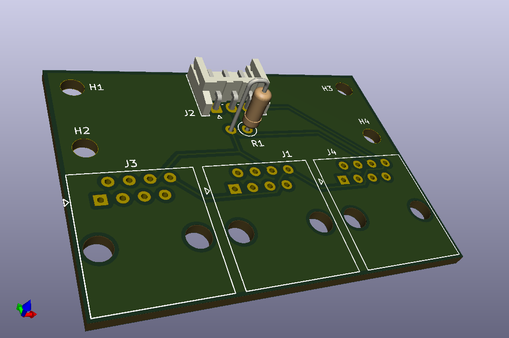
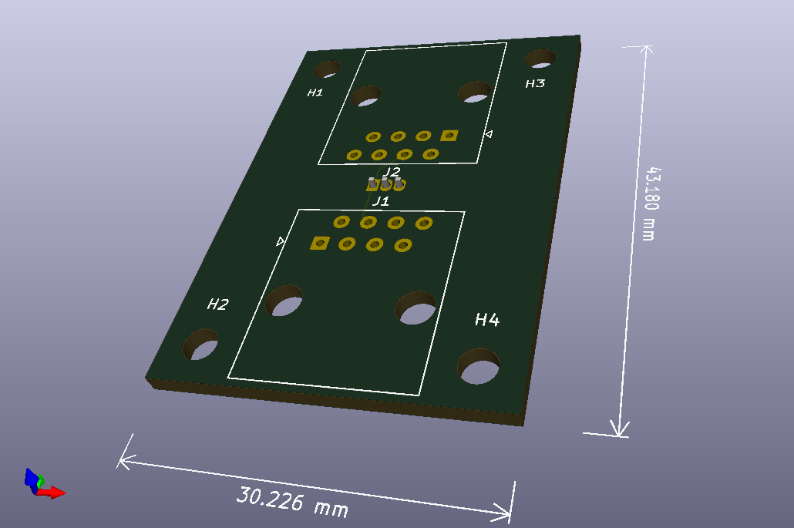

# Printed circuit board (PCB) designs
Schemes for convenient small pcb's of the two main components of this project. 
Software used to create and edit this is [KiCad](https://www.kicad-pcb.org/).

Each module can be also soldered by hand on a proto-board or even directly on 
the connector pins, but using a custom pcb is easier.

## [pam_main_module](pam_main_module)
KiCad project for the main module that connects to a single-board device (RPi) 
GPIO pins and then uses a common UTP over RJ45 (aka ethernet) to connect 1-Wire
thermal sensors. Pins used/needed are: +3.3V, GROUND and DATA (digital I/O).
Board is designed with 3 RJ45 connectors so you can route the cables in multiple 
directions, but only one is required to be soldered in place.

## [pam_chain_module](pam_chain_module)
KiCad project for the chain module with thermal sensor. This module features 
2 RJ45 connectors for daisy-chaining them in series. Thermal sensor is soldered 
on the opposite side so that it's not sandwiched between the two RJ45 casings for more
accurate readings.

